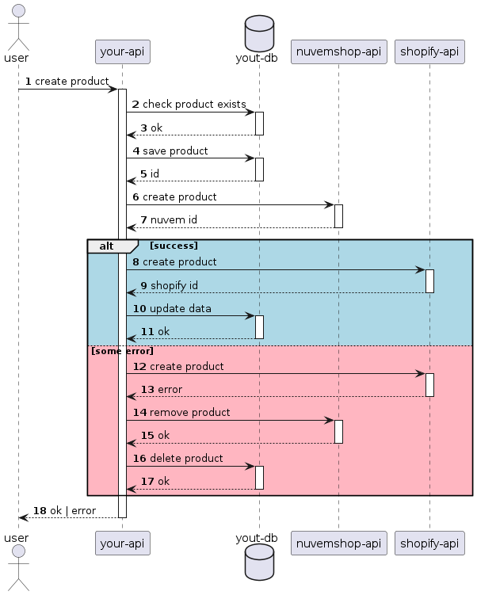
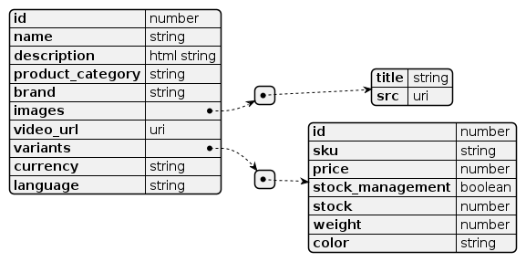
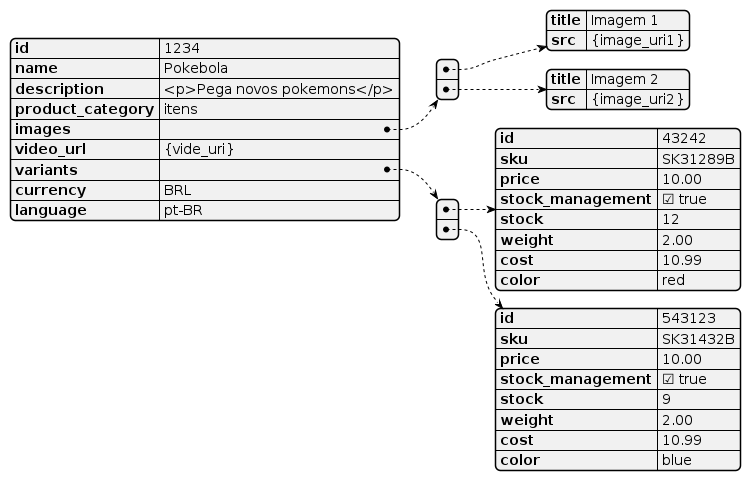

# PT-BR 🇧🇷
# Tech Challenge Ecosystem
O desafio consiste em implementar um **APP** para criação de produtos numa loja.

O app consiste de uma api, que deve salvar os produtos num banco relacional, e sincronizar a criação do produto nas lojas onde o app está instalado.

O app deve sincronizar a criação simultaneamente nas lojas criadas na [nuvemshop](https://www.nuvemshop.com.br/) quanto nas lojas criadas na [shopify](https://www.shopify.com/br)

* [Documentação](https://tiendanube.github.io/api-documentation/resources/product) da api de produtos nuvemshop
* [Documentação](https://shopify.dev/docs/api/admin-rest/2023-10/resources/product) da api de produtos da shopify.

## Descrição do serviço

Crie um serviço que receba as informações de produtos e sincronize com as lojas nas 2 plataformas. O serviço deve prover uma abstração entre as 2 plataformas. 

O serviço deve prover um endpoint rest para criação do produto, com suas variantes (cor, tamanho, etc).

O serviço deve persistir as informações num banco relacional (sugerimos mysql)

Se a criação do produto em uma das plataformas falhar, toda a criação do produto deve falhar. Ou seja, a criação do produto deve ser uma operação atômica entra os 3 sistemas.

Abaixo temos um diagrama explicando o fluxo geral, você não precisa seguir esse fluxo ao pé da letra:



Como falado, você não precisa seguir exatamente esse fluxo, contanto que o serviço garanta a atomicidade da operação.

## Propriedades da Entidade de Produto


### Exemplo



## Autênticação
Antes de realizar chamadas nas apis das plataformas, é necessario primeiro realizar uma autenticação 

* [Documentação](https://tiendanube.github.io/api-documentation/authentication) de Autênticação da Api nuvemshop
* [Documentação](https://shopify.dev/docs/api/admin-rest#authentication) de Autênticação da Api shopify

Para fins de agilidade nesse desafio, vamos prover chaves de acesso já configuradas nas 2 plataformas.

**Nuvemshop**
```
ClientId = 32112
ClientSecret = 42341312
```
**Shopify**
```
ClientId = 32112
ClientSecret = 42341312
```


## Orientações finais
* Esse desafio deve ser feito em typescript, preferencialmente em [NestJS](https://nestjs.com/) ou [ExpresJS](https://expressjs.com/).
* O Código deve ser feito em inglês.
* Você pode utilizar qualquer lib que ache interessante, desde que justifique o porquê.
* Deixe claro como você testaria a sua solução, e se possível, crie pelo menos 1 teste.

---

<p style="color:red; font-weight: bold;  font-size: 21px; text-align:center"> **** Atenção ****</p>

Entendemos que o tempo é curto para finalizar todo o desafio, esse **não** é o foco desse desafio.
O foco desse desafio é entender como você trabalha num ambiente nebuloso:
* Como você resolveria os problemas propostos?
* Como você organiza sua soluçao?
* Quais trade-offs você analisou?
* Quais dúvidas você teve?
* Como você explicou a sua solução?

---
